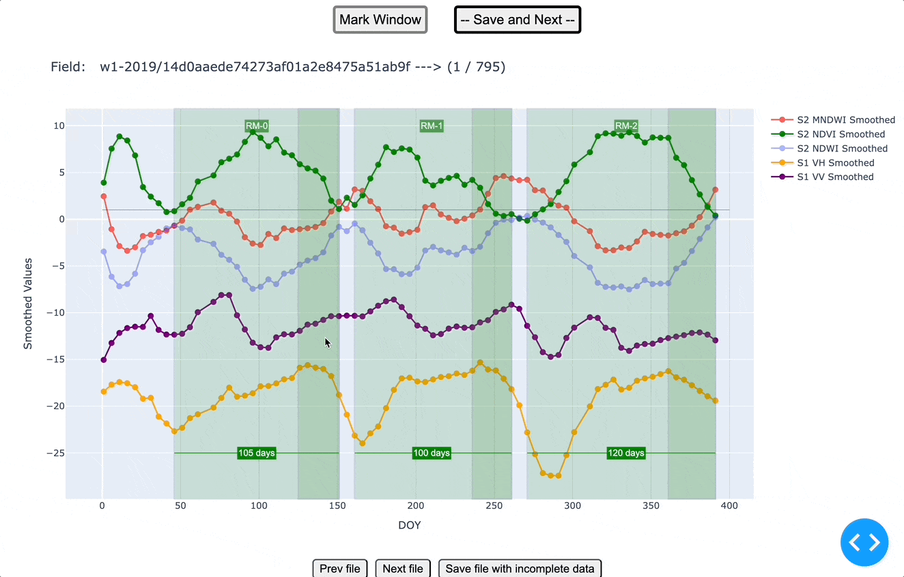

# temporal events in rice fields



### Add csv files
Place your CSV files containing temporal event data in the following directory:
```bash
data/input/<folder>
```

Replace `<folder>` with the appropriate subfolder name, if necessary.

### Build Docker image

- Navigate to your project directory in the terminal.
- Run the following command to build the Docker image
    ```bash
    docker compose build
    ```

### Run the Application

After successfully building the Docker image, start the application by running:
```bash
docker compose up
```
This command will start all the services defined in the docker-compose.yml file and make the application available for use.

### Accessing the Application:

Once the application is running, go to [http://localhost:8060](http://localhost:8060).

## Directory Structure

```css
project-root/
├── data/
│   └── input/
│       └── <folder>/
│           ├── file1.csv
│           └── file2.csv
├── Dockerfile
├── docker-compose.yml
└── ...

```

### Alias script

```bash
rice_fields='docker run --rm \
    -v ${HOME}/Developer/rice_fields/python_script:/app \
    -v ${HOME}/Developer/rice_fields/data:/mnt \
    -p 8060:8060 \
    -e DATA_PATH=/mnt \
    geocompas/rice_fields:v1 python server.py'
```

### Permissions
In some cases,

```shell
sudo chmod -R 777 ./data

```

### Shortcuts

- `a`: create windows
- `d`: Save and Next
- `w`: remove last window